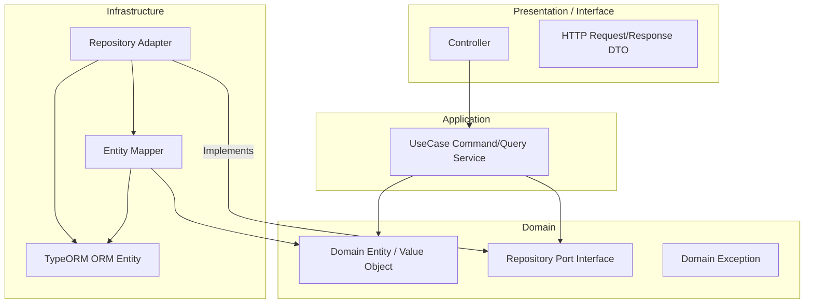

# 백엔드 개발 및 AI 에이전트 규칙 (Developer Standards)

본 문서는 프로젝트의 핵심 비즈니스 정체성을 확립하고, 변경에 유연한 견고한 백엔드 시스템을 구축하기 위해 DDD(도메인 주도 설계) 및 포트-어댑터(Hexagonal) 아키텍처 규칙을 정의합니다. AI 에이전트(Antigravity)와 개발자는 본 프로토콜을 반드시 준수하여 일관성 있는 고품질 코드를 작성해야 합니다.

---

## 1. 핵심 원칙 (Core Principles)

1. **DDD (도메인 주도 설계)**: 도메인 격리 및 비즈니스 중심 설계 필수.
2. **TDD (테스트 주도 개발)**: 새로운 비즈니스 로직 작성 시 단위 테스트 필수 작성.
3. **GitHub Flow**: main 브랜치는 항상 배포 가능해야 하며, Conventional Commits를 준수합니다.
4. **Airbnb Style**: 코드 컨벤션은 Airbnb 스타일을 최우선으로 적용합니다.

---

## 2. 개발 환경 및 컨벤션 (Environment & Conventions)

- **Node.js**: >= 24, **pnpm**: >= 10
- **Line Endings**: LF 엔딩 강제 (`.gitattributes` + `.editorconfig`)
- **다국어 및 번역**: 문서화는 한국어를 기본으로 하며, 코드 주석 및 커밋 메시지는 영어로 통일합니다.
- **문서 위치**: 모든 사양서와 의사결정록은 `docs/specs/` 및 `docs/adr/` 하위에 위치시킵니다.

---

## 3. 아키텍처 원칙 (Architecture Blueprint)

의존성의 단방향 흐름을 강제하고, 프레임워크 및 데이터베이스 기술로부터 비즈데이 도메인을 분리하기 위해 **포트-어댑터(Ports & Adapters) 아키텍처**를 사용합니다.

---

## 4. AI 개발 핵심 제약 사항 (Core Constraints for AI)

AI 에이전트가 코드를 작성하거나 변경할 때 실수하기 쉬운 핵심 규칙들이며, 예외 없이 강제 적용됩니다.

### 4.1. 도메인 레이어의 완전성 격리 (Domain Purity)
- **위치**: `domain/` 디렉토리 하위 of 모든 파일 (`models/`, `repository-ports/`, `exceptions/`)
- **제약**: 순수 TypeScript 코드로만 구성되어야 합니다. `@nestjs/common`, `@nestjs/typeorm`, `typeorm`을 포함한 어떠한 프레임워크 데코레이터나 라이브러리도 임포트할 수 없습니다.

### 4.2. CQS(Command Query Separation) 분리 규격
- **상태 변경 (Command)**: 데이터 쓰기를 수행하는 UseCase는 `~Command.usecase.ts`로 구현하며, 단일 트랜잭션 단위로 실행되도록 `typeorm-transactional` 모듈의 `@Transactional()`을 최상위 메서드에 적용합니다.
- **조회 (Query)**: 단순 데이터 조회를 수행하는 UseCase는 `~Query.usecase.ts` 또는 `~QueryService`로 구현하며, 불필요한 트랜잭션 래핑을 금지합니다.

### 4.3. 상태 매핑 격리 (Mappers & Adapters)
- 데이터베이스 세부 테이블 구조와 매핑되는 **ORM Entity**(`PostOrmEntity` 등)는 `infrastructure/` 계층에만 존재해야 하며, 도메인 비즈니스 로직 및 프레젠테이션(Controller) 계층으로 노출될 수 없습니다.
- 외부 노출과 영속성 처리를 위해 상호 변환 시 반드시 static 메서드를 지닌 `PostMapper` 등 매퍼 클래스를 경유해야 합니다.

### 4.4. 순수 도메인 예외 (Domain Exceptions)
- **제약**: 도메인(`domain/`) 및 애플리케이션(`application/`) 레이어에서는 NestJS가 제공하는 `HttpException` 계열(`NotFoundException`, `ForbiddenException` 등)을 직접 `throw`해서는 안 않습니다.
- **구현**: 모든 커스텀 비즈니스 예외는 [domain.exception.ts](file:///Users/limkeunhyeok/Desktop/nestjs-api-server-sample/src/common/exceptions/domain.exception.ts)의 `BaseDomainException`을 상속받아 정의해야 합니다.
- **필터 매핑**: 던져진 도메인 예외는 `AllExceptionsFilter`에서 예외 유형에 대응하는 HTTP 상태 코드로 자동 매핑되어 클라이언트 응답으로 변환됩니다.

### 4.5. 코드 작성 전 사용자 명확한 승인 (Confirmation Before Code Generation)
- **제약**: 에이전트는 프로젝트 소스 코드 파일을 생성하거나 수정하기 전에 **반드시 어떤 범위의 코드를 어떻게 변경할 것인지 계획과 인터페이스(의사코드 포함)를 먼저 제시하고 사용자의 명시적인 승인(예: "동의", "진행해주세요")을 얻어야만 합니다.**
- **동작**: 사용자 승인 없이 파일 쓰기(write_to_file)나 수정(replace_file_content) 도구를 함부로 선제 호출하지 마십시오.

### 4.6. 민감한 설정 및 환경 변수 파일 접근 금지 (Security Constraint)
- **제약**: 에이전트는 자격 증명 정보, API 비밀키 등이 포함될 수 있는 `.env`, `.env.template`, `.env.local` 등 민감한 환경 설정 파일의 내용을 조회하거나 읽기 도구(`view_file` 등)를 통해 열람해서는 안 됩니다.

### 4.7. 데이터베이스 직접 질의 금지 (Database Safety Constraint)
- **제약**: 에이전트는 터미널 명령어 실행 도구(`run_command` 등)를 통해 데이터베이스에 직접 CLI 커넥션(예: `psql`, `redis-cli` 등)을 수립하거나 쿼리를 실행해서는 안 됩니다. 모든 데이터베이스 접근은 인프라 레포지토리 코드 또는 ORM 마이그레이션 도구를 경유하여 제어되어야 합니다.

### 4.8. 프레임워크 예외 의존성 전면 차단 (No Framework Exceptions)
- **제약**: 프로젝트의 어떤 레이어에서도 `@nestjs/common`에서 제공하는 `HttpException` 및 하위 예외 클래스(`BadRequestException`, `NotFoundException` 등)를 직접 `throw`하지 않습니다.
- **수동 HTTP 예외 발급**: 컨트롤러, 미들웨어, 가드 등에서 명시적인 HTTP 오류(예: 400, 401 등)를 발생시켜야 하는 경우에는 오직 직접 정의된 `ApiException`만을 사용합니다.
- **예외 매핑 표준화**: 모든 비즈니스 도메인 오류는 `BaseDomainException`으로 던져지고, 외부 HTTP 관련 오류는 `ApiException`으로 던져집니다. `AllExceptionsFilter`가 이 두 커스텀 예외를 수신하여 최종 HTTP API JSON Response로 일원화하여 매핑합니다.

### 4.9. Git 관련 커밋 직접 실행 금지 (Git Command Restriction)
- **제약**: 에이전트는 어떠한 경우에도 직접 `git add`, `git commit`, `git push` 등 버전을 관리하거나 커밋을 생성하는 명령을 터미널 도구(`run_command` 등)로 실행해서는 안 됩니다.
- **역할**: Git 커밋 및 형상 관리는 오직 사용자가 수동으로 수행하며, 에이전트는 사용자가 요청할 때 한하여 커밋 메시지 추천 등의 텍스트 조력만 제공할 수 있습니다.
