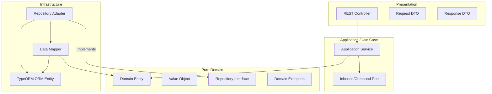
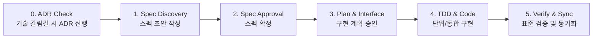

# 백엔드 개발 및 AI 에이전트 규칙 (Developer Standards)

본 문서는 프로젝트의 핵심 비즈니스 정체성을 확립하고, 변경에 유연한 견고한 백엔드 시스템을 구축하기 위해 DDD(도메인 주도 설계) 및 포트-어댑터(Hexagonal) 아키텍처 규칙을 정의합니다. AI 에이전트(Antigravity)와 개발자는 본 프로토콜을 반드시 준수하여 일관성 있는 고품질 코드를 작성해야 합니다.

---

## 1. 핵심 원칙 (Core Principles)

1. **DDD (도메인 주도 설계)**: 도메인 격리 및 비즈니스 중심 설계 필수.
2. **TDD (테스트 주도 개발)**: 새로운 비즈니스 로직 작성 시 단위 테스트 필수 작성.
3. **GitHub Flow**: main 브랜치는 항상 배포 가능해야 하며, Conventional Commits를 준수합니다.
4. **Airbnb Style**: 코드 컨벤션은 Airbnb 스타일을 최우선으로 적용합니다.

---

## 2. 개발 환경 및 컨벤션 (Environment & Conventions)

- **Node.js**: >= 24, **pnpm**: >= 10
- **Line Endings**: LF 엔딩 강제 (`.gitattributes` + `.editorconfig`)
- **다국어 및 번역**: 문서화는 한국어를 기본으로 하며, 코드 주석 및 커밋 메시지는 영어로 통일합니다.
- **문서 위치**: 모든 사양서와 의사결정록은 `docs/specs/` 및 `docs/adr/` 하위에 위치시킵니다.

---

## 3. 아키텍처 원칙 (Architecture Blueprint)

의존성의 단방향 흐름을 강제하고, 프레임워크 및 데이터베이스 기술로부터 비즈니스 도메인을 분리하기 위해 **포트-어댑터(Ports & Adapters) 아키텍처**를 사용합니다.

---

## 4. AI 개발 핵심 제약 사항 (Core Constraints for AI)

AI 에이전트가 코드를 작성하거나 변경할 때 실수하기 쉬운 핵심 규칙들이며, 예외 없이 강제 적용됩니다.

### 4.1. 도메인 레이어의 완전성 격리 (Domain Purity)
- **위치**: `domain/` 디렉토리 하위의 모든 서브디렉토리 (`entities/`, `value-objects/`, `repositories/`, `services/`, `exceptions/` 등)
- **제약**: 순수 TypeScript 코드로만 구성되어야 합니다. `@nestjs/common`, `@nestjs/typeorm`, `typeorm`을 포함한 어떠한 프레임워크 데코레이터나 라이브러리도 임포트할 수 없습니다.

### 4.2. CQS(Command Query Separation) 분리 규격
- **상태 변경 (Command)**: 데이터 쓰기를 수행하는 UseCase는 `~Command.usecase.ts` 또는 서비스 형태로 구현하며, 단일 트랜잭션 단위로 실행되도록 `typeorm-transactional` 모듈의 `@Transactional()`을 최상위 메서드에 적용합니다.
- **조회 (Query)**: 단순 데이터 조회를 수행하는 UseCase는 `~Query.usecase.ts` 또는 조회 서비스로 구현하며, 불필요한 트랜잭션 래핑을 금지합니다.

### 4.3. 상태 매핑 격리 (Mappers & Adapters)
- 데이터베이스 세부 테이블 구조와 매핑되는 **ORM Entity**(`PostOrmEntity` 등)는 `infrastructure/persistence/entities/` 계층에만 존재해야 하며, 도메인 비즈니스 로직 및 프레젠테이션(Controller) 계층으로 노출될 수 없습니다.
- 외부 노출과 영속성 처리를 위해 상호 변환 시 반드시 static 메서드를 지닌 `Mapper` 클래스(`infrastructure/persistence/mappers/` 또는 `application/mappers/`)를 경유해야 합니다.

### 4.4. 순수 도메인 예외 (Domain Exceptions)
- **제약**: 도메인(`domain/`) 및 애플리케이션(`application/`) 레이어에서는 NestJS가 제공하는 `HttpException` 계열(`NotFoundException`, `ForbiddenException` 등)을 직접 `throw`해서는 안 됩니다.
- **구현**: 모든 커스텀 비즈니스 예외는 [domain.exception.ts](file:///Users/limkeunhyeok/Desktop/nestjs-api-server-sample/src/common/exceptions/domain.exception.ts)의 `BaseDomainException`을 상속받아 정의해야 합니다.
- **필터 매핑**: 던져진 도메인 예외는 `AllExceptionsFilter`에서 예외 유형에 대응하는 HTTP 상태 코드로 자동 매핑되어 클라이언트 응답으로 변환됩니다.

### 4.5. 코드 작성 전 사용자 명확한 승인 (Confirmation Before Code Generation)
- **제약**: 에이전트는 프로젝트 소스 코드 파일을 생성하거나 수정하기 전에 **반드시 어떤 범위의 코드를 어떻게 변경할 것인지 계획과 인터페이스(의사코드 포함)를 먼저 제시하고 사용자의 명시적인 승인(예: "동의", "진행해주세요")을 얻어야만 합니다.**
- **동작**: 사용자 승인 없이 파일 쓰기(write_to_file)나 수정(replace_file_content) 도구를 함부로 선제 호출하지 마십시오.

### 4.6. 민감한 설정 및 환경 변수 파일 접근 금지 (Security Constraint)
- **제약**: 에이전트는 자격 증명 정보, API 비밀키 등이 포함될 수 있는 `.env`, `.env.template`, `.env.local` 등 민감한 환경 설정 파일의 내용을 조회하거나 읽기 도구(`view_file` 등)를 통해 열람해서는 안 됩니다.

### 4.7. 데이터베이스 직접 질의 금지 (Database Safety Constraint)
- **제약**: 에이전트는 터미널 명령어 실행 도구(`run_command` 등)를 통해 데이터베이스에 직접 CLI 커넥션(예: `psql`, `redis-cli` 등)을 수립하거나 쿼리를 실행해서는 안 됩니다. 모든 데이터베이스 접근은 인프라 레포지토리 코드 또는 ORM 마이그레이션 도구를 경유하여 제어되어야 합니다.

### 4.8. 프레임워크 예외 의존성 전면 차단 (No Framework Exceptions)
- **제약**: 프로젝트의 어떤 레이어에서도 `@nestjs/common`에서 제공하는 `HttpException` 및 하위 예외 클래스(`BadRequestException`, `NotFoundException` 등)를 직접 `throw`하지 않습니다.
- **수동 HTTP 예외 발급**: 컨트롤러, 미들웨어, 가드 등에서 명시적인 HTTP 오류(예: 400, 401 등)를 발생시켜야 하는 경우에는 오직 직접 정의된 `ApiException`만을 사용합니다.
- **예외 매핑 표준화**: 모든 비즈니스 도메인 오류는 `BaseDomainException`으로 던져지고, 외부 HTTP 관련 오류는 `ApiException`으로 던져집니다. `AllExceptionsFilter`가 이 두 커스텀 예외를 수신하여 최종 HTTP API JSON Response로 일원화하여 매핑합니다.

### 4.9. Git 관련 커밋 직접 실행 금지 (Git Command Restriction)
- **제약**: 에이전트는 어떠한 경우에도 직접 `git add`, `git commit`, `git push` 등 버전을 관리하거나 커밋을 생성하는 명령을 터미널 도구(`run_command` 등)로 실행해서는 안 됩니다.
- **역할**: Git 커밋 및 형상 관리는 오직 사용자가 수동으로 수행하며, 에이전트는 사용자가 요청할 때 한하여 커밋 메시지 추천 등의 텍스트 조력만 제공할 수 있습니다.

### 4.10. 불필요한 빌드 및 린트 검증 생략 (No Redundant Validation)
- **제약**: 에이전트는 단순 문서(README.md, ADR, Spec 명세 등 마크다운 파일) 작성이나 정적 리소스 추가와 같이 소스 코드의 컴파일 결과 및 런타임 동작에 어떠한 부수 효과(Side-effect)도 미치지 않는 독립적인 작업을 수행한 경우, 터미널 도구를 통해 `pnpm build`, `pnpm lint` 등의 기계적이고 무의미한 검증 명령을 실행하여 프로세스와 피드백 단계를 낭비해서는 안 됩니다.
- **예외**: 소스 코드 수정이 수반되거나 실제로 린트/컴파일 검증이 유의미한 코드베이스 변경 시에 한해서만 검증 도구를 기동합니다.
- **허용 검증 명령어 규격**: 소스 코드 검증 시에는 오직 다음의 프로젝트 정의 표준 명령어만 사용해야 합니다:
  - 단위 검증: `pnpm run test`
  - 타입 검증: `pnpm run typecheck`
  - 린트 검증: `pnpm run lint`
  - E2E 검증: `pnpm run test:e2e`

### 4.11. 초정밀 디렉토리 표준 구조 강제 준수 (Standard Directory Tree Constraint)
- **제약**: 신규 파일을 생성하거나 기존 코드를 리팩토링 및 재배치할 때, 에이전트는 [아키텍처 표준 명세서(architecture-specification.md)](file:///Users/limkeunhyeok/Desktop/nestjs-api-server-sample/docs/specs/architecture-specification.md)에 기술된 표준 서브디렉토리 명세(`application/dto/`, `domain/value-objects/`, `infrastructure/persistence/mappers/` 등)를 한 치의 오차도 없이 엄격히 준수하여 배치하여야 합니다. 임의로 디렉토리 구조를 평평하게 변경하는 행위를 원천 금지합니다.

---

## 5. SDD(명세 기반 개발) 및 의사결정 프로토콜 (SDD & Decision Protocol)

본 프로젝트는 비즈니스 무결성과 구현의 일관성을 유지하기 위해 **SDD(Spec-Driven Development, 명세 기반 개발)**와 **ADR(Architecture Decision Records, 아키텍처 의사결정 기록)**을 핵심 엔지니어링 프로토콜로 채택합니다.

### 5.1. Spec vs ADR 작성 기준 (Decision Matrix)

작업의 성격에 따라 작성해야 하는 문서 유형이 명확히 구분됩니다:

| 구분 | **Spec (`docs/specs/`)** | **ADR (`docs/adr/`)** |
| :--- | :--- | :--- |
| **핵심 목적** | **What** — 비즈니스 요구사항 및 기능 명세 | **Why** — 기술적 갈림길에서의 대안 비교 및 결정 |
| **작성 기준** | 도메인 모델, 비즈니스 규칙(`BR-xxx`), 유스케이스, API 인터페이스 정의 시 | 프레임워크/라이브러리 도입, DB/캐시 전략 선택, 아키텍처 패턴 결정 시 |
| **문서 성격** | **Living Document** (비즈니스 변경 시 지속 갱신) | **Immutable Document** (한번 승인되면 불변, 변경 시 새 ADR 발행) |
| **작성 시점** | 비즈니스 기능 개발 및 도메인 리팩토링 전 | 번복하기 어려운 기술적 결정 및 구조적 변경 발생 시 |

* **복합 시나리오 (ADR + Spec)**: 새로운 기술/인프라(예: SSE 알림, Redis Write-Behind 등)를 도입하여 기능을 구현할 때는 **ADR을 먼저 작성하여 기술 결정을 확정한 후**, 이를 기반으로 **Spec 사양서**를 작성하고 상호 링크를 연결합니다.

---

### 5.2. SDD 5단계 개발 라이프사이클 (5-Stage SDD Lifecycle)

1. **Step 1 — 명세 초안 작성 (Spec Discovery & Draft)**:
   - 새로운 기술 도입이나 아키텍처적 트레이드오프가 수반되는 경우 `docs/adr/`에 ADR을 먼저 작성합니다.
   - 비즈니스 요구사항과 도메인 모델을 `docs/specs/<domain>-domain.md` 파일에 먼저 명세합니다.
   - 필수 항목: 도메인 모델(클래스 다이어그램), 비즈니스 규칙(`BR-xxx`), 유스케이스(`UC-xxx`), 예외 체계, API 인터페이스, 오픈 질문.
   - 최상단 프론트매터의 상태를 `status: draft`로 설정하고 `docs/specs/README.md` 인덱스에 등록합니다.
2. **Step 2 — 스펙 검토 및 확정 (Spec Approval)**:
   - 작성된 사양서를 사용자에게 공유하고 기술적/비즈니스적 합의를 거칩니다.
   - 확정 시 프론트매터와 인덱스의 상태를 `status: approved`로 변경합니다.
3. **Step 3 — 구현 계획 및 인터페이스 승인 (Implementation Plan)**:
   - [AGENTS.md 4.5](file:///Users/limkeunhyeok/Desktop/nestjs-api-server-sample/.agents/AGENTS.md) 규칙에 따라 어떤 범위의 파일들을 어떻게 변경할 것인지 의사코드와 함께 제시하고 명시적 승인을 받습니다.
4. **Step 4 — TDD 기반 구현 (Implementation with Tests)**:
   - 순수 도메인 모델(`entities/`, `value-objects/`), 포트 인터페이스(`repository-ports/`), 인프라 어댑터(`repositories/`, `mappers/`), 서비스, DTO, 컨트롤러 순서로 구현합니다.
   - 도메인 단위 테스트(`.spec.ts`)를 함께 작성하여 비즈니스 규칙의 자가 검증을 보장합니다.
5. **Step 5 — 표준 검증 및 스펙 동기화 (Verification & Status Update)**:
   - 표준 명령어 4종(`test`, `lint`, `typecheck`, `test:e2e`)으로 완전성을 검증합니다.
   - 구현 과정에서 변경되거나 구체화된 비즈니스 규칙이 있다면 스펙 문서에 즉시 역동기화합니다.

### 5.3. 규칙 및 유스케이스 식별자 체계 (Identifier Conventions)

추적성(Traceability)과 명확한 소통을 위해 스펙과 코드, 테스트 전반에서 일관된 식별자 규칙을 적용합니다:

| 구분 | 식별자 패턴 | 예시 |
| :--- | :--- | :--- |
| **비즈니스 규칙 (Business Rules)** | `BR-<도메인이니셜><두자리숫자>` | `BR-U01` (User), `BR-A01` (Auth), `BR-P01` (Post) |
| **유스케이스 (Use Cases)** | `UC-<도메인이니셜><두자리숫자>` | `UC-U01` (User), `UC-A01` (Auth), `UC-P01` (Post) |
| **아키텍처 의사결정 (ADR)** | `ADR-<네자리숫자>` | `ADR-0001`, `ADR-0002`, `ADR-0003` |

### 5.4. 스펙 동기화 의무 (Spec Sync Obligation)

- `docs/specs/` 하위의 사양서는 일회성 기획 문서가 아닌 **코드베이스의 단일 진실 공급원(Single Source of Truth)**입니다.
- 엔티티 속성 추가, 비즈니스 규칙 변경, DTO 스키마 수정 등 도메인/인터페이스의 변경이 일어날 경우, 소스 코드 수정과 함께 반드시 대응하는 스펙 문서도 같은 트랜잭션 단위로 갱신되어야 합니다.

