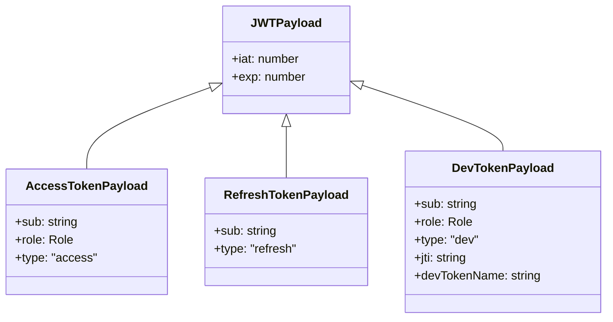
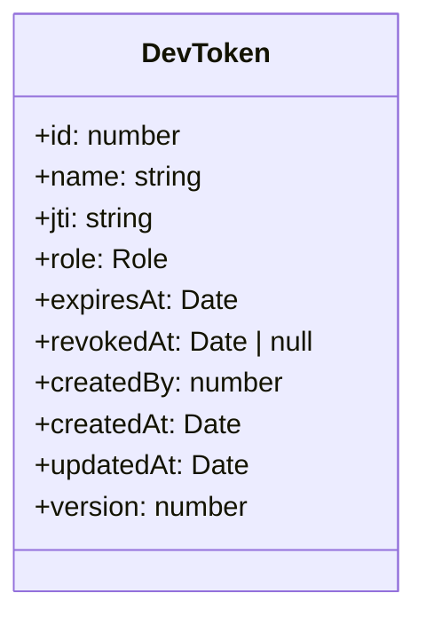
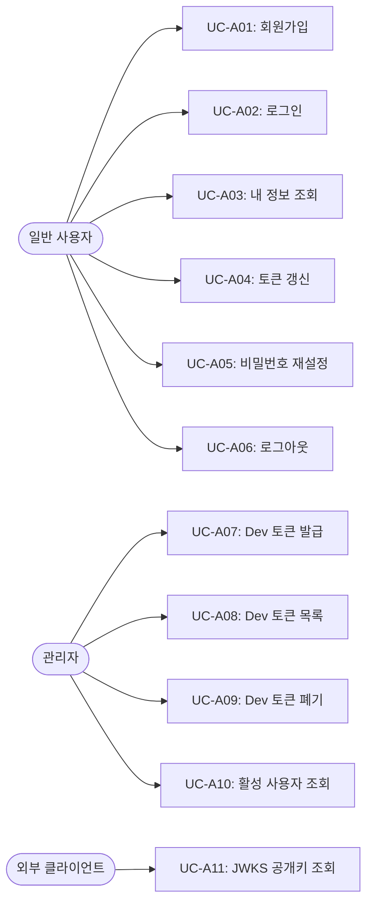

# Auth 도메인 명세 (Auth Domain Specification)

본 문서는 게시판 시스템의 **Auth(인증 및 인가) 바운디드 컨텍스트**에 대한 도메인 모델, 비즈니스 규칙, 유스케이스, 보안 정책 및 API 인터페이스 사양을 정의합니다.

---

## 1. 개요 (Summary)

Auth 도메인은 시스템의 모든 사용자에 대한 **신원 인증(Authentication)**, **권한 검증(Authorization)**, **JWT 세션 및 토큰 생명주기(발급, 갱신, 블랙리스트, 폐기)**, **개발자 전용 토큰(Dev Token)**, **실시간 활성 사용자 추적**, 그리고 **JWKS 기반 공개키 배포**를 전담하는 보안 핵심 바운디드 컨텍스트입니다.

비대칭 암호화(ES256) 기반의 JWT 토큰을 발행하며, User 도메인과 협력하여 자격 증명을 검증합니다.

---

## 2. 목표 및 제외 대상 (Goals / Non-goals)

### Goals
- 이메일/비밀번호 기반 사용자 인증 및 JWT (Access Token, Refresh Token) 발급
- 비대칭 암호화(ES256) 및 JWKS(`/.well-known/jwks.json`) 표준을 통한 공개키 배포
- Redis 기반 토큰 블랙리스트를 통한 즉각적인 로그아웃(토큰 무효화) 보장
- 개발/테스트 환경을 위한 장기 만료 개발자 전용 토큰(Dev Token) 관리 및 실시간 폐기 제어
- Redis 기반 5분 슬라이딩 윈도우 활성 사용자(Active Users) 실시간 집계
- 주요 보안 엔드포인트 대상 무차별 대입(Brute-force) 방지 Rate Limiting 적용

### Non-goals
- 사용자 계정 자체의 영속성 및 프로필 CRUD (→ User 도메인 책임)
- 외부 OAuth/소셜 로그인(구글, 카카오 등) 연동
- 이메일 SMTP 연동을 통한 실제 비밀번호 재설정 링크 발송 (현재는 임시 비밀번호 직접 생성)

---

## 3. 도메인 모델 (Domain Model)

### 3.1 토큰 구조 및 페이로드 모델 (Token Payload Models)

Auth 도메인에서는 3가지 상이한 목적의 JWT 토큰 유형을 관리합니다.



| 토큰 유형 | 타입 식별자 (`type`) | 유효 기간 | 페이로드 주요 필드 | 용도 |
| :--- | :--- | :--- | :--- | :--- |
| **Access Token** | `access` | 1시간 (`1h`) | `sub`(userId), `role`, `type`, `iat`, `exp` | API 요청 인가 인증 |
| **Refresh Token** | `refresh` | 30일 (`30d`) | `sub`(userId), `type`, `iat`, `exp` | Access Token 재발급 |
| **Dev Token** | `dev` | 커스텀 (기본 `365d`) | `sub`, `role`, `type`, `jti`, `devTokenName`, `iat`, `exp` | 비운영 환경 개발/테스트 전용 |

---

### 3.2 DevToken 엔티티 (Dev Token Entity)

개발자 전용 장기 토큰의 발급 내역 및 실시간 폐기(Revocation) 상태를 추적하기 위한 엔티티입니다.



| 속성 | 타입 | 설명 | 제약 조건 |
| :--- | :--- | :--- | :--- |
| `id` | `number` | 자동 생성 기본키 (PK) | Auto Increment |
| `name` | `string` | 토큰 식별용 이름/목적 | Not Null |
| `jti` | `string` | JWT 고유 식별자 (UUID) | Unique, Index |
| `role` | `Role` | 부여된 권한 등급 | `admin` \| `member` \| `guest`, 기본값: `member` |
| `expiresAt` | `Date` | 토큰 만료 일시 | Not Null |
| `revokedAt` | `Date \| null` | 토큰 폐기 일시 | Nullable (null이면 유효, 값이 있으면 폐기됨) |
| `createdBy` | `number` | 토큰을 발급한 관리자 ID | Not Null |

---

## 4. 비즈니스 규칙 (Business Rules)

### 4.1 자격 증명 검증 및 보안 에러 마스킹 (BR-A01)
- 로그인 시 이메일 존재 여부와 비밀번호 일치 여부를 검증합니다.
- 이메일이 존재하지 않거나 비밀번호가 일치하지 않는 모든 경우, 계정 존재 여부 유출을 방지하기 위해 동일하게 `InvalidEmailOrPasswordException` (400, `Invalid email or password.`)을 반환합니다.

### 4.2 토큰 타입 격리 및 서명 검증 (BR-A02)
- 토큰 파싱 시 `jose` 비대칭 암호화 키셋(Local JWKSet)을 통해 무결성과 만료 시간을 검증합니다.
- 토큰 갱신 엔드포인트(`POST /auth/refresh`)는 오직 `type === 'refresh'`인 토큰만 허용하며, Access Token이나 Dev Token 전달 시 `TOKEN_TYPE_MISMATCH` (401) 에러로 거부합니다.
- 일반 API 인가 미들웨어(`AuthMiddleware`)는 `access` 또는 `dev` 타입만 허용합니다.

### 4.3 개발자 토큰 환경 및 폐기 제약 (BR-A03)
- **운영 환경 차단**: `NODE_ENV === 'production'` 환경에서는 개발자 토큰 발급이 원천 금지되며, 시도 시 `DevTokenBadRequestException` (400)이 발생합니다.
- **관리자 전용**: 관리자(`Role.ADMIN`) 권한을 가진 사용자만 발급 및 폐기를 수행할 수 있습니다.
- **실시간 폐기 검증**: `AuthMiddleware`는 `dev` 토큰 수신 시 `jti`를 추출하여 DB의 `revokedAt` 필드를 확인하며, 폐기된 경우 `401 Unauthorized`로 차단합니다.

### 4.4 로그아웃 및 토큰 블랙리스트 (BR-A04)
- `POST /auth/logout` 호출 시, 요청에 사용된 Access Token의 남은 만료 시간(`exp - now`)을 계산하여 Redis에 블랙리스트 키(`auth:blacklist:<sha256(token)>`)로 등록합니다.
- `AuthMiddleware`는 모든 요청 검증의 최우선 단계에서 해당 토큰의 블랙리스트 여부를 조회하여 즉각 차단합니다.

### 4.5 실시간 활성 사용자 추적 정책 (BR-A05)
- 인가된 모든 요청 시 `ActiveUsersService`를 통해 사용자 ID를 5분(`300,000ms`) TTL의 Redis 키로 기록합니다.
- 인덱스 키(`auth:active-users:__index__`)를 유지하고 주기적으로 만료된 사용자를 Pruning하여 최근 5분 이내 활동한 활성 사용자 수와 목록을 산출합니다.

### 4.6 엔드포인트별 Rate Limiting 정책 (BR-A06)
무차별 대입 공격 및 자원 고갈을 방어하기 위해 Throttler 가드를 적용합니다.

| 엔드포인트 | 속도 제한 (Rate Limit) | 목적 |
| :--- | :--- | :--- |
| `POST /auth/login` | 1분당 5회 | 패스워드 브루트포스 공격 방지 |
| `POST /auth/register` | 1분당 10회 | 무차별 회원가입 방지 |
| `POST /auth/forgot-password` | 1분당 3회 | 난수 비밀번호 재설정 남용 방지 |

---

## 5. 유스케이스 (Use Cases)



### UC-A01: 회원가입 (Register)
- **행위자**: 비인증 사용자
- **기본 흐름**: 이메일, 비밀번호, 이름을 받아 `UserService.createUser`를 호출(기본 `member` 역할)한 뒤, Access Token 및 Refresh Token 쌍을 발급하여 반환.
- **예외**: 이메일 중복 시 `EmailAlreadyRegisteredException` (400).

### UC-A02: 로그인 (Login)
- **행위자**: 비인증 사용자
- **기본 흐름**: 이메일/비밀번호 검증 후 일치 시 Access Token 및 Refresh Token 쌍 발급.
- **예외**: 이메일 미존재 또는 비밀번호 불일치 시 `InvalidEmailOrPasswordException` (400).

### UC-A03: 내 정보 조회 (Get Me)
- **행위자**: 인증된 사용자
- **기본 흐름**: 토큰 페이로드의 `sub`를 기반으로 사용자 상세 정보를 조회하여 반환.
- **예외**: 해당 사용자가 DB에서 삭제된 경우 `ApiException` (401, `Invalid credentials`).

### UC-A04: 토큰 갱신 (Refresh Tokens)
- **행위자**: 클라이언트 (유효한 Refresh Token 보유자)
- **기본 흐름**: Refresh Token의 서명/타입 검증 후, 소유자의 최신 권한 상태를 반영하여 새로운 Access Token 및 Refresh Token 쌍을 발급.
- **예외**: 토큰 만료 시 401 (`TOKEN_EXPIRED`), 토큰 타입 불일치 시 401 (`TOKEN_TYPE_MISMATCH`).

### UC-A05: 비밀번호 재설정 (Forgot Password)
- **행위자**: 사용자
- **기본 흐름**: 이메일로 사용자 조회 후 8자리 난수 비밀번호를 생성하여 `UserService.resetUserPassword` 호출 후 반환.
- **예외**: 미존재 이메일 시 `UserNotFoundException` (404).

### UC-A06: 로그아웃 (Logout)
- **행위자**: 인증된 사용자
- **기본 흐름**: 요청 헤더의 Access Token 남은 만료 시간만큼 Redis 블랙리스트에 저장하여 즉시 무효화.

### UC-A07: 개발자 토큰 발급 (Create Dev Token)
- **행위자**: Admin
- **기본 흐름**: 토큰 이름, 역할, 만료 기간을 받아 `dev` 타입의 JWT 발급 및 `dev_token` DB 레코드 생성.
- **예외**: 프로덕션 환경 시 `DevTokenBadRequestException` (400).

### UC-A08: 개발자 토큰 목록 조회 (List Dev Tokens)
- **행위자**: Admin
- **기본 흐름**: 폐기되지 않은(`revokedAt IS NULL`) 모든 Dev 토큰 목록을 최신순으로 조회.

### UC-A09: 개발자 토큰 폐기 (Revoke Dev Token)
- **행위자**: Admin
- **기본 흐름**: `id`로 Dev 토큰을 조회하여 `revokedAt`을 현재 시간으로 업데이트.
- **예외**: 미존재 시 `DevTokenNotFoundException` (404), 이미 폐기된 경우 `DevTokenBadRequestException` (400).

### UC-A10: 활성 사용자 수 및 목록 조회 (Active Users)
- **행위자**: Admin
- **기본 흐름**: 최근 5분 이내 활동한 사용자 수(`count`) 또는 사용자 ID 목록(`userIds`) 반환.

### UC-A11: JWKS 공개키 조회 (Get JWKS)
- **행위자**: 누구나 (Public 엔드포인트)
- **기본 흐름**: 토큰 서명 검증을 위한 비대칭 공개키(JWK) 목록 반환 (비밀키 `d` 필드 원천 배제).

---

## 6. 도메인 예외 (Exceptions)

### 6.1 도메인 예외 (`BaseDomainException` 상속)

| 예외 클래스 | DomainExceptionCode | HTTP 상태 | 발생 조건 |
| :--- | :--- | :--- | :--- |
| `InvalidEmailOrPasswordException` | `BAD_REQUEST` | 400 | 이메일 미존재 또는 비밀번호 불일치 |
| `DevTokenBadRequestException` | `BAD_REQUEST` | 400 | 프로덕션 환경에서 Dev 토큰 생성 시도, 이미 폐기된 토큰 재폐기 시도 |
| `DevTokenNotFoundException` | `NOT_FOUND` | 404 | 존재하지 않는 Dev 토큰 ID 조회/폐기 시도 |

### 6.2 HTTP 인가 예외 (`ApiException`)

| 메시지 상수 | HTTP 상태 | 발생 조건 |
| :--- | :--- | :--- |
| `MISSING_AUTHORIZATION_HEADER` | 401 | Authorization 헤더 누락 |
| `INVALID_AUTHORIZATION_HEADER_FORMAT` | 401 | Bearer 스킴 형식이 아님 |
| `TOKEN_EXPIRED` | 401 | JWT 유효기간 만료 |
| `INVALID_OR_MALFORMED_TOKEN` | 401 | 서명 불일치 또는 변조된 토큰 |
| `TOKEN_TYPE_MISMATCH` | 401 | 엔드포인트가 요구하는 토큰 타입과 불일치 |
| `Token has been revoked.` | 401 | 로그아웃으로 블랙리스트에 등록된 토큰 |
| `Dev token has been revoked.` | 401 | 관리자에 의해 폐기된 개발자 토큰 |
| `INVALID_CREDENTIALS` | 401 | 토큰의 사용자가 데이터베이스에 더 이상 존재하지 않음 |

---

## 7. API 인터페이스 사양 (REST API)

### 7.1 회원가입

```
POST /auth/register
Content-Type: application/json
```

**Request Body:**
```json
{
  "email": "user@example.com",
  "password": "password123",
  "name": "홍길동"
}
```

| 필드 | 타입 | 필수 | 제약 조건 |
| :--- | :--- | :--- | :--- |
| `email` | string | ✅ | 이메일 형식, 최대 60자 |
| `password` | string | ✅ | 최소 8자, 최대 15자 |
| `name` | string | ✅ | 최소 1자 이상 |

**Response (201 Created):**
```json
{
  "accessToken": "eyJhbGciOiJFUzI1NiIs...",
  "refreshToken": "eyJhbGciOiJFUzI1NiIs..."
}
```

---

### 7.2 로그인

```
POST /auth/login
Content-Type: application/json
```

**Request Body:**
```json
{
  "email": "user@example.com",
  "password": "password123"
}
```

**Response (200 OK):**
```json
{
  "accessToken": "eyJhbGciOiJFUzI1NiIs...",
  "refreshToken": "eyJhbGciOiJFUzI1NiIs..."
}
```

---

### 7.3 내 정보 조회

```
GET /auth/me
Authorization: Bearer <accessToken>
```

**Response (200 OK):**
```json
{
  "id": 1,
  "email": "user@example.com",
  "name": "홍길동",
  "role": "member",
  "latestTryLoginDate": null,
  "version": 1,
  "createdAt": "2026-08-16T00:00:00.000Z",
  "updatedAt": "2026-08-16T00:00:00.000Z"
}
```

---

### 7.4 토큰 갱신

```
POST /auth/refresh
Content-Type: application/json
```

**Request Body:**
```json
{
  "refreshToken": "eyJhbGciOiJFUzI1NiIs..."
}
```

**Response (200 OK):**
```json
{
  "accessToken": "eyJhbGciOiJFUzI1NiIs...",
  "refreshToken": "eyJhbGciOiJFUzI1NiIs..."
}
```

---

### 7.5 비밀번호 재설정

```
POST /auth/forgot-password
Content-Type: application/json
```

**Request Body:**
```json
{
  "email": "user@example.com"
}
```

**Response (200 OK):**
```json
{
  "newPassword": "aB3$kL9p"
}
```

---

### 7.6 로그아웃

```
POST /auth/logout
Authorization: Bearer <accessToken>
```

**Response (200 OK):**
```json
{
  "message": "Successfully logged out."
}
```

---

### 7.7 개발자 토큰 관리 API (Admin 전용)

| Method | Endpoint | 설명 |
| :--- | :--- | :--- |
| `POST` | `/auth/dev-tokens` | 개발자 전용 토큰 발급 (`{ name, role?, expiresIn? }`) |
| `GET` | `/auth/dev-tokens` | 폐기되지 않은 개발자 토큰 목록 조회 |
| `DELETE` | `/auth/dev-tokens/:id` | 특정 개발자 토큰 폐기 |

---

### 7.8 활성 사용자 추적 API (Admin 전용)

| Method | Endpoint | 설명 |
| :--- | :--- | :--- |
| `GET` | `/auth/active-users/count` | 최근 5분 이내 활성 사용자 수 (`{ count: number }`) |
| `GET` | `/auth/active-users` | 최근 5분 이내 활성 사용자 ID 목록 (`{ userIds: string[] }`) |

---

### 7.9 JWKS 공개키 배포 (Public)

```
GET /.well-known/jwks.json
```

**Response (200 OK):**
```json
{
  "keys": [
    {
      "kty": "EC",
      "crv": "P-256",
      "x": "...",
      "y": "...",
      "kid": "...",
      "alg": "ES256",
      "use": "sig"
    }
  ]
}
```

---

## 8. 캐시 및 저장소 키 설계 (Storage & Cache Keys)

| 용도 | 키 패턴 | 저장소 | TTL |
| :--- | :--- | :--- | :--- |
| 토큰 블랙리스트 | `auth:blacklist:<sha256(token)>` | Redis / Memory | 토큰 남은 만료 시간 (`exp - now`) |
| 토큰 검증 캐시 | `auth:access-token:<sha256(token)>` | Redis / Memory | `max((exp - now - 30s), 1s)` |
| 활성 사용자 기록 | `auth:active-users:<userId>` | Redis / Memory | 5분 (`300,000ms`) |
| 활성 사용자 인덱스 | `auth:active-users:__index__` | Redis / Memory | 영구 (Pruning 방식으로 관리) |

---

## 9. 오픈 질문 (Open Questions)

- [ ] **임시 비밀번호 직접 노출 보안 이슈**: `POST /auth/forgot-password` 호출 시 새 임시 비밀번호를 HTTP 응답 바디로 즉시 반환하고 있습니다. 향후 이메일 전송 인프라(AWS SES, Nodemailer 등) 도입 시 이메일 전송 방식으로 전환할지 여부 결정이 필요합니다.
- [ ] **Refresh Token Rotation 및 화이트리스트 관리**: 현재 Refresh Token은 DB나 Redis에 저장되지 않고 JWT 자체 검증만 수행합니다. 탈취된 Refresh Token의 즉시 무효화를 위해 Refresh Token 저장소(RTR 패턴) 도입을 고려할 수 있습니다.
- [ ] **DevToken 도메인 모델 격리**: 현재 `DevTokenOrmEntity`가 서비스와 컨트롤러에 직접 노출되어 있습니다. DDD 표준에 따라 `DevToken` 순수 도메인 엔티티 및 매퍼를 도입할지 검토가 필요합니다.
