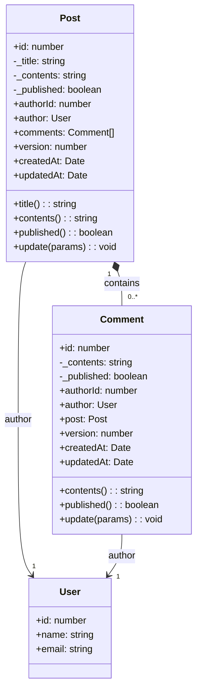
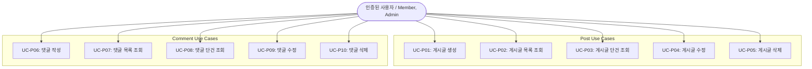

# Post 도메인 명세 (Post & Comment Domain Specification)

본 문서는 게시판 시스템의 **Post(게시글) 및 Comment(댓글) 바운디드 컨텍스트**에 대한 도메인 모델, 비즈니스 규칙, 유스케이스, 캐싱 전략 및 API 인터페이스 사양을 정의합니다.

---

## 1. 개요 (Summary)

Post 도메인은 커뮤니티 및 게시판의 핵심 비즈니스 기능을 담당하며, **게시글(Post)**과 게시글에 종속되는 **댓글(Comment)**의 생명주기(생성, 페이징 조회, 단건 조회, 수정, 삭제)를 관리합니다.

작성자 본인 또는 관리자만 콘텐츠를 수정/삭제할 수 있는 **소유권 기반 접근 제어(Ownership Policy)**와 게시글-댓글 간의 **부모-자식 관계 무결성(Association Integrity)**을 도메인 수준에서 강제합니다.

---

## 2. 목표 및 제외 대상 (Goals / Non-goals)

### Goals
- 게시글(`Post`)의 생성, 조회, 수정, 삭제(CRUD) 및 페이지네이션/필터링
- 특정 게시글에 종속된 댓글(`Comment`)의 생성, 조회, 수정, 삭제(CRUD) 및 페이징
- 게시글 및 댓글의 공개/비공개(`published`) 상태 제어
- 작성자(`authorId`)와 관리자(`admin`) 권한에 기반한 수정/삭제 인가 제어
- 다계층 캐싱(목록/단건 조회 캐시 및 변경 시 `@CacheEvict` 무효화)

### Non-goals
- 게시글 첨부파일 및 이미지 미디어 업로드 처리
- 게시글 좋아요/추천/조회수 카운팅 기능 (현재 스펙 외)
- 대댓글(Nested / Threaded Comments) 계층형 구조 (현재는 단일 레벨 댓글만 지원)

---

## 3. 도메인 모델 (Domain Model)

### 3.1 Post & Comment 애그리거트 구조

게시판 바운디드 컨텍스트는 `Post` 애그리거트 루트와 이에 종속된 `Comment` 엔티티로 구성됩니다.



---

### 3.2 엔티티 속성 상세

#### Post (게시글 애그리거트 루트)

| 속성 | 타입 | 설명 | 제약 조건 |
| :--- | :--- | :--- | :--- |
| `id` | `number` | 자동 생성 기본키 (PK) | Auto Increment, Read-only |
| `title` | `string` | 게시글 제목 | 최소 1자, 최대 100자 |
| `contents` | `string` | 게시글 본문 | Not Empty |
| `published` | `boolean` | 공개 여부 | 기본값: `true` |
| `authorId` | `number` | 작성자 User ID | Foreign Key (User) |
| `author` | `User \| undefined` | 작성자 도메인 엔티티 | 도메인 로드 시 선택적 주입 |
| `comments` | `Comment[] \| undefined` | 종속된 댓글 목록 | 도메인 로드 시 선택적 주입 |
| `version` | `number` | Optimistic Lock 버전 | ORM 자동 관리 |
| `createdAt` | `Date` | 작성 일시 | ORM 자동 관리 |
| `updatedAt` | `Date` | 최종 수정 일시 | ORM 자동 관리 |

#### Comment (댓글 종속 엔티티)

| 속성 | 타입 | 설명 | 제약 조건 |
| :--- | :--- | :--- | :--- |
| `id` | `number` | 자동 생성 기본키 (PK) | Auto Increment, Read-only |
| `contents` | `string` | 댓글 본문 | Not Empty |
| `published` | `boolean` | 공개 여부 | 기본값: `true` |
| `authorId` | `number` | 작성자 User ID | Foreign Key (User) |
| `author` | `User \| undefined` | 작성자 도메인 엔티티 | 도메인 로드 시 선택적 주입 |
| `post` | `Post \| undefined` | 소속 게시글 도메인 엔티티 | 필수 연관 관계 |
| `version` | `number` | Optimistic Lock 버전 | ORM 자동 관리 |
| `createdAt` | `Date` | 작성 일시 | ORM 자동 관리 |
| `updatedAt` | `Date` | 최종 수정 일시 | ORM 자동 관리 |

---

## 4. 비즈니스 규칙 (Business Rules)

### 4.1 소유권 기반 수정 및 삭제 권한 정책 (BR-P01)
- 게시글 및 댓글의 수정(`update`)과 삭제(`delete`)는 다음 조건 중 하나를 만족해야 합니다:
  1. **작성자 본인**: 요청자의 `sub`(사용자 ID)가 대상 리소스의 `authorId`와 일치.
  2. **관리자**: 요청자의 `role`이 `admin`.
- 위 조건을 충족하지 못할 경우, 권한 부족 예외가 발생합니다:
  - 게시글: `PostForbiddenException` (403, `You are not allowed to modify this resource.`)
  - 댓글: `CommentForbiddenException` (403, `You are not allowed to modify this resource.`)

### 4.2 게시글-댓글 연관 관계 무결성 검증 (BR-P02)
- 댓글의 조회, 수정, 삭제 요청 시 URL 경로에 지정된 `:postId`와 실제 댓글 엔티티가 가리키는 `comment.post.id`가 반드시 일치해야 합니다.
- 만약 다른 게시글의 댓글 ID를 지정하여 요청할 경우, 데이터 오염 방지를 위해 `CommentConflictException` (409, `The requested resource is not associated with the given parent resource.`)을 발생시킵니다.

### 4.3 연관 도메인 존재성 보장 (BR-P03)
- **게시글 작성 시**: `UserService.getUserById`를 통해 유효한 작성자가 존재하는지 사전 검증합니다.
- **댓글 작성 시**: `UserService.getUserById` 및 `PostService.getPostById`를 통해 유효한 작성자와 유효한 대상 게시글이 모두 존재하는지 사전 검증합니다.

### 4.4 공개 상태 캡슐화 및 변경 정책 (BR-P04)
- 게시글과 댓글의 `published` 필드는 기본적으로 `true`로 설정됩니다.
- 엔티티의 `update()` 비즈니스 메소드를 통해서만 제목, 본문, 공개 여부의 상태 변화를 안전하게 캡슐화하여 처리합니다.

---

## 5. 유스케이스 (Use Cases)



### UC-P01: 게시글 생성 (Create Post)
- **행위자**: 인증된 사용자 (`admin`, `member`)
- **기본 흐름**: 제목, 본문, 공개 여부를 받아 현재 로그인한 사용자(`sub`)를 작성자로 지정하여 `Post` 엔티티를 생성 및 저장.
- **후행 조건**: 게시글 캐시 무효화.

### UC-P02: 게시글 목록 페이지네이션 조회 (Paginate Posts)
- **행위자**: 인증된 사용자 (`admin`, `member`)
- **기본 흐름**: 페이징 파라미터(`limit`, `offset`, `sortField`, `sortDirection`) 및 필터(`authorId`, `published`, `startDate`, `endDate`)를 기반으로 게시글 목록과 전체 건수 반환.
- **캐싱**: 파라미터별 조합 캐시 적용 (첫 페이지 2시간, 필터 적용 시 30분, 기본 1시간).

### UC-P03: 게시글 단건 상세 조회 (Get Post By Id)
- **행위자**: 인증된 사용자 (`admin`, `member`)
- **기본 흐름**: `postId`로 게시글을 조회하여 작성자 정보(`author`)와 함께 반환.
- **예외**: 미존재 시 `PostNotFoundException` (404).
- **캐싱**: 1시간 TTL 캐시 적용.

### UC-P04: 게시글 수정 (Update Post)
- **행위자**: 작성자 본인 또는 관리자
- **기본 흐름**: `postId`로 게시글 조회 → 소유권 검증(BR-P01) → `post.update()` 호출 → DB 저장.
- **예외**: 미존재 시 `PostNotFoundException` (404), 권한 없음 시 `PostForbiddenException` (403).
- **후행 조건**: 게시글 캐시 무효화.

### UC-P05: 게시글 삭제 (Delete Post)
- **행위자**: 작성자 본인 또는 관리자
- **기본 흐름**: `postId`로 게시글 조회 → 소유권 검증(BR-P01) → DB 레코드 삭제.
- **예외**: 미존재 시 `PostNotFoundException` (404), 권한 없음 시 `PostForbiddenException` (403).
- **후행 조건**: 게시글 캐시 무효화.

---

### UC-P06: 댓글 작성 (Create Comment)
- **행위자**: 인증된 사용자 (`admin`, `member`)
- **기본 흐름**: `postId` 유효성 검증 → 사용자 확인 → `Comment` 엔티티 생성 및 저장.
- **예외**: 부모 게시글 미존재 시 `PostNotFoundException` (404).
- **후행 조건**: 댓글 캐시 무효화.

### UC-P07: 댓글 목록 페이지네이션 조회 (Paginate Comments)
- **행위자**: 인증된 사용자 (`admin`, `member`)
- **기본 흐름**: 특정 게시글(`postId`)에 달린 댓글 목록을 페이징 및 필터링하여 반환.
- **캐싱**: 파라미터별 조합 캐시 적용 (첫 페이지 2시간, 필터 적용 시 30분, 기본 1시간).

### UC-P08: 댓글 단건 조회 (Get Comment By Id)
- **행위자**: 인증된 사용자 (`admin`, `member`)
- **기본 흐름**: `postId` 검증 → `commentId` 조회 → 부모 게시글 연관성 검증(BR-P02) → 반환.
- **예외**: 게시글 미존재 시 404, 댓글 미존재 시 404, 부모 게시글 불일치 시 409 (`CommentConflictException`).

### UC-P09: 댓글 수정 (Update Comment)
- **행위자**: 댓글 작성자 본인 또는 관리자
- **기본 흐름**: `postId` 검증 → `commentId` 조회 → 연관성 검증(BR-P02) → 소유권 검증(BR-P01) → `comment.update()` 호출 → 저장.
- **예외**: 404 (미존재), 409 (부모 불일치), 403 (권한 없음).
- **후행 조건**: 댓글 캐시 무효화.

### UC-P10: 댓글 삭제 (Delete Comment)
- **행위자**: 댓글 작성자 본인 또는 관리자
- **기본 흐름**: `postId` 검증 → `commentId` 조회 → 연관성 검증(BR-P02) → 소유권 검증(BR-P01) → DB 삭제.
- **예외**: 404 (미존재), 409 (부모 불일치), 403 (권한 없음).
- **후행 조건**: 댓글 캐시 무효화.

---

## 6. 도메인 예외 (Exceptions)

모든 예외는 `BaseDomainException`을 상속하며, `AllExceptionsFilter`를 통해 HTTP 응답으로 변환됩니다.

| 예외 클래스 | DomainExceptionCode | HTTP 상태 | 발생 조건 |
| :--- | :--- | :--- | :--- |
| `PostNotFoundException` | `NOT_FOUND` | 404 | 존재하지 않는 `postId`로 조회/수정/삭제 시도 |
| `PostForbiddenException` | `FORBIDDEN` | 403 | 작성자 본인 또는 관리자가 아닌 사용자의 수정/삭제 시도 |
| `CommentNotFoundException` | `NOT_FOUND` | 404 | 존재하지 않는 `commentId`로 조회/수정/삭제 시도 |
| `CommentForbiddenException` | `FORBIDDEN` | 403 | 댓글 작성자 본인 또는 관리자가 아닌 사용자의 수정/삭제 시도 |
| `CommentConflictException` | `CONFLICT` | 409 | 지정한 `postId`와 댓글의 실제 소속 게시글 ID가 불일치 |

---

## 7. API 인터페이스 사양 (REST API)

모든 엔드포인트는 `@Roles([Role.ADMIN, Role.MEMBER])` 가드로 보호되며 `Authorization: Bearer <accessToken>` 헤더가 필요합니다.

### 7.1 게시글 API (Posts)

#### [POST] `/posts` — 게시글 생성
- **Request Body:**
  ```json
  {
    "title": "게시글 제목입니다.",
    "contents": "게시글 본문 내용입니다.",
    "published": true
  }
  ```
- **Response (201 Created):**
  ```json
  {
    "id": 1,
    "title": "게시글 제목입니다.",
    "contents": "게시글 본문 내용입니다.",
    "published": true,
    "authorId": 1,
    "author": { "id": 1, "email": "user@example.com", "name": "작성자" },
    "createdAt": "2026-08-16T00:00:00.000Z",
    "updatedAt": "2026-08-16T00:00:00.000Z"
  }
  ```

#### [GET] `/posts` — 게시글 목록 조회 (페이지네이션)
- **Query Parameters:**
  - `limit` (number, 필수), `offset` (number, 필수)
  - `sortField` (string, 필수: `id`, `published`, `createdAt`, `updatedAt`)
  - `sortDirection` (string, 필수: `asc`, `desc`)
  - `authorId` (number, 선택), `published` (boolean, 선택)
  - `startDate` (string, 선택), `endDate` (string, 선택)
- **Response (200 OK):**
  ```json
  {
    "data": [
      {
        "id": 1,
        "title": "게시글 제목",
        "contents": "본문",
        "published": true,
        "authorId": 1,
        "createdAt": "...",
        "updatedAt": "..."
      }
    ],
    "total": 50,
    "limit": 10,
    "offset": 0
  }
  ```

#### [GET] `/posts/:postId` — 게시글 단건 상세 조회
- **Response (200 OK):** `PostResponseDto`

#### [PUT] `/posts/:postId` — 게시글 수정
- **Request Body (모든 필드 선택):**
  ```json
  {
    "title": "수정된 제목",
    "contents": "수정된 본문",
    "published": false
  }
  ```
- **Response (200 OK):** `PostResponseDto`

#### [DELETE] `/posts/:postId` — 게시글 삭제
- **Response (200 OK):** 삭제된 `PostResponseDto`

---

### 7.2 댓글 API (Comments)

#### [POST] `/posts/:postId/comments` — 댓글 작성
- **Request Body:**
  ```json
  {
    "contents": "댓글 내용입니다.",
    "published": true
  }
  ```
- **Response (201 Created):** `CommentResponseDto`

#### [GET] `/posts/:postId/comments` — 댓글 목록 페이지네이션 조회
- **Query Parameters:** `limit`, `offset`, `sortField`, `sortDirection`, `authorId`, `published`, `startDate`, `endDate`
- **Response (200 OK):** `PaginationResponse<CommentResponseDto>`

#### [GET] `/posts/:postId/comments/:commentId` — 댓글 단건 조회
- **Response (200 OK):** `CommentResponseDto`

#### [PUT] `/posts/:postId/comments/:commentId` — 댓글 수정
- **Request Body:**
  ```json
  {
    "contents": "수정된 댓글 내용",
    "published": true
  }
  ```
- **Response (200 OK):** `CommentResponseDto`

#### [DELETE] `/posts/:postId/comments/:commentId` — 댓글 삭제
- **Response (200 OK):** 삭제된 `CommentResponseDto`

---

## 8. 리포지토리 포트 인터페이스 (Repository Ports)

```typescript
export interface PostRepositoryPort {
  findOneById(id: number): Promise<Post | null>;
  save(post: Post): Promise<Post>;
  paginate(params: {
    authorId?: number;
    published?: boolean;
    startDate?: Date;
    endDate?: Date;
    limit: number;
    offset: number;
    sortField: string;
    sortDirection: SortDirection;
  }): Promise<PaginationResponse<Post>>;
  delete(id: number): Promise<void>;
}

export interface CommentRepositoryPort {
  findOneById(id: number): Promise<Comment | null>;
  save(comment: Comment): Promise<Comment>;
  paginate(params: {
    authorId?: number;
    postId?: number;
    published?: boolean;
    startDate?: Date;
    endDate?: Date;
    limit: number;
    offset: number;
    sortField: string;
    sortDirection: SortDirection;
  }): Promise<PaginationResponse<Comment>>;
  delete(id: number): Promise<void>;
}
```

---

## 9. 캐싱 전략 (Caching Strategy)

| 리소스 | 캐시 키 패턴 | TTL | 무효화 트리거 |
| :--- | :--- | :--- | :--- |
| 게시글 목록 (첫 페이지, 필터 없음) | `posts:pagination:*` | 2시간 | 게시글 생성, 수정, 삭제 시 `@CacheEvict` |
| 게시글 목록 (필터 적용) | `posts:pagination:*` | 30분 | 게시글 생성, 수정, 삭제 시 `@CacheEvict` |
| 게시글 목록 (기본) | `posts:pagination:*` | 1시간 | 게시글 생성, 수정, 삭제 시 `@CacheEvict` |
| 게시글 단건 조회 | `posts:id:<postId>` | 1시간 | 게시글 생성, 수정, 삭제 시 `@CacheEvict` |
| 댓글 목록 (첫 페이지, 필터 없음) | `comments:pagination:*` | 2시간 | 댓글 생성, 수정, 삭제 시 `@CacheEvict` |
| 댓글 목록 (필터 적용) | `comments:pagination:*` | 30분 | 댓글 생성, 수정, 삭제 시 `@CacheEvict` |
| 댓글 목록 (기본) | `comments:pagination:*` | 1시간 | 댓글 생성, 수정, 삭제 시 `@CacheEvict` |
| 댓글 단건 조회 | `comments:id:<commentId>` | 1시간 | 댓글 생성, 수정, 삭제 시 `@CacheEvict` |

---

## 10. 오픈 질문 (Open Questions)

- [ ] **게시글 삭제 시 댓글 연계 처리 정책**: 현재 게시글이 삭제되었을 때 해당 게시글에 달린 댓글들을 DB 레벨의 `CASCADE` 삭제로 처리할지, 논리적 Soft Delete로 보존할지, 또는 도메인 이벤트를 통해 비동기 정리할지에 대한 비즈니스 정책 명시가 필요합니다.
- [ ] **비공개(`published: false`) 콘텐츠 조회 권한 제어**: 현재 목록 조회 API에서 `published` 필터 파라미터를 넘기지 않으면 비공개 글도 함께 조회될 수 있습니다. 일반 회원은 타인의 비공개 글을 볼 수 없도록 하는 조회 필터 가드 정책의 필요 여부 검토가 필요합니다.
- [ ] **도메인 값 객체(VO) 확장**: 제목 길이 제한(1~100자) 등을 캡슐화하는 `PostTitle`, `CommentContents` 등의 VO 도입 여부를 고려할 수 있습니다.
