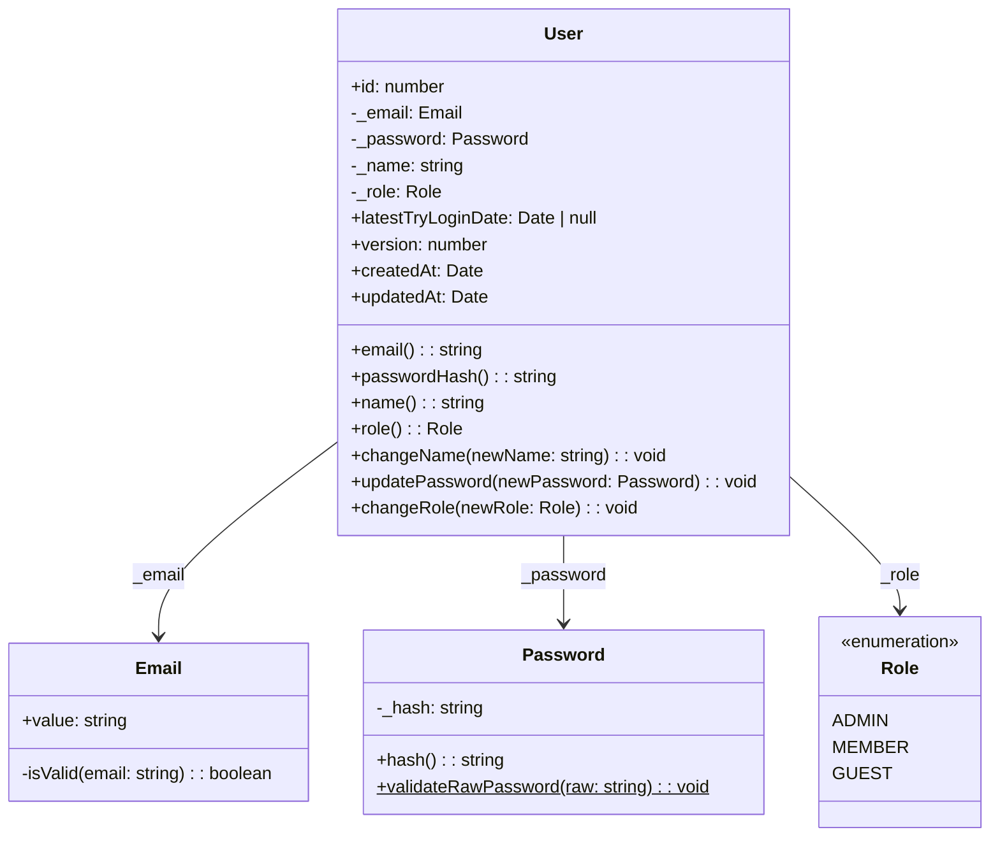

# User 도메인 명세 (User Domain Specification)

본 문서는 게시판 시스템의 **User(사용자) 바운디드 컨텍스트**에 대한 도메인 모델, 비즈니스 규칙, 유스케이스, 그리고 API 인터페이스 사양을 정의합니다.

---

## 1. 개요 (Summary)

User 도메인은 시스템의 모든 사용자 계정 정보를 관리하고, 역할(Role) 기반의 권한 체계를 제공하는 핵심 도메인입니다. 회원 생성, 조회, 수정, 삭제(CRUD) 및 비밀번호 재설정 기능을 포함하며, Auth 도메인과 협력하여 인증/인가의 근거 데이터를 제공합니다.

---

## 2. 목표 및 제외 대상 (Goals / Non-goals)

### Goals
- 사용자 계정의 생명주기(생성 → 조회 → 수정 → 삭제) 관리
- 이메일 유일성 및 비밀번호 강도 정책의 도메인 수준 강제
- 역할(Role) 기반 접근 제어 모델 제공
- 소유자/관리자 기반 리소스 수정 권한 정책

### Non-goals
- 인증 토큰(JWT) 발급 및 검증 (→ Auth 도메인 책임)
- 로그인/로그아웃 세션 관리 (→ Auth 도메인 책임)
- 소셜 로그인(OAuth) 연동
- 사용자 프로필 이미지 업로드

---

## 3. 도메인 모델 (Domain Model)

### 3.1 User 애그리거트 (Aggregate Root)

User는 이 바운디드 컨텍스트의 유일한 애그리거트 루트입니다.



### 3.2 엔티티 속성 상세

| 속성 | 타입 | 설명 | 제약 조건 |
| :--- | :--- | :--- | :--- |
| `id` | `number` | 자동 생성 기본키 (PK) | Auto Increment, Read-only |
| `email` | `Email` (VO) | 사용자 이메일 주소 | Unique, 최대 60자, 이메일 형식 필수 |
| `password` | `Password` (VO) | bcrypt 해시 처리된 비밀번호 | Not Empty |
| `name` | `string` | 사용자 표시명 | 최대 60자, 빈 문자열 불가 |
| `role` | `Role` | 사용자 권한 등급 | `admin` / `member` / `guest` 중 하나, 기본값: `member` |
| `latestTryLoginDate` | `Date \| null` | 마지막 로그인 시도 일시 | Nullable |
| `version` | `number` | Optimistic Lock 버전 | ORM 자동 관리 |
| `createdAt` | `Date` | 생성 일시 | ORM 자동 관리 |
| `updatedAt` | `Date` | 최종 수정 일시 | ORM 자동 관리 |

### 3.3 값 객체 (Value Objects)

#### Email

이메일 주소의 형식 유효성을 생성 시점에 자가 검증하는 불변 값 객체입니다.

| 규칙 | 상세 |
| :--- | :--- |
| 형식 검증 | `/\S+@\S+\.\S+/` 정규식 통과 필수 |
| 불변성 | 생성 후 값 변경 불가 |
| 위반 시 | `Error('유효하지 않은 이메일 형식입니다.')` |

#### Password

비밀번호 해시의 비공백 무결성을 보장하고, 원문 비밀번호의 강도 정책을 정적 메소드로 검증하는 불변 값 객체입니다.

| 규칙 | 상세 |
| :--- | :--- |
| 해시 검증 | 빈 문자열 또는 공백만으로 구성된 해시 불허 |
| 원문 길이 | 최소 8자, 최대 15자 (`validateRawPassword`) |
| 불변성 | 생성 후 해시 값 변경 불가, 변경 시 새 인스턴스 생성 |
| 위반 시 (해시) | `Error('비밀번호 해시는 비어있을 수 없습니다.')` |
| 위반 시 (원문) | `Error('비밀번호는 8자 이상, 15자 이하여야 합니다.')` |

---

## 4. 비즈니스 규칙 (Business Rules)

### 4.1 이메일 유일성

동일한 이메일 주소로 중복 가입할 수 없습니다. 사용자 생성 시 이메일 중복 여부를 레포지토리를 통해 확인하고, 중복 시 `EmailAlreadyRegisteredException`을 발생시킵니다.

### 4.2 소유권 기반 수정/삭제 권한 (Ownership Policy)

사용자 정보의 수정 및 삭제는 다음 조건 중 하나를 충족해야 합니다:

| 조건 | 설명 |
| :--- | :--- |
| 본인 | 요청자의 `sub`(사용자 ID)가 대상 사용자의 `id`와 일치 |
| 관리자 | 요청자의 `role`이 `admin` |

위 조건을 모두 만족하지 못하면 `UserForbiddenException`이 발생합니다.

### 4.3 이름 변경 유효성

빈 문자열 또는 공백만으로 구성된 이름으로의 변경은 도메인 엔티티 수준에서 거부됩니다.

### 4.4 비밀번호 해싱 정책

평문 비밀번호는 Application Service 계층에서 `bcrypt`를 사용하여 해싱되며, Salt Round는 환경 변수(`SALT_ROUND`)로 관리합니다. 도메인 엔티티는 해싱된 값만 취급합니다.

---

## 5. 유스케이스 (Use Cases)

### UC-U01: 사용자 생성

| 항목 | 내용 |
| :--- | :--- |
| 행위자 | Admin |
| 선행 조건 | 유효한 Access Token, Admin 역할 |
| 기본 흐름 | 1. 이메일 중복 확인 → 2. 비밀번호 유효성 검증 → 3. bcrypt 해싱 → 4. User 엔티티 생성 → 5. 저장 |
| 후행 조건 | 새 사용자 레코드 생성, 관련 캐시 무효화 |
| 예외 | 이메일 중복 시 `EmailAlreadyRegisteredException` (400) |

### UC-U02: 사용자 목록 페이지네이션 조회

| 항목 | 내용 |
| :--- | :--- |
| 행위자 | Admin |
| 선행 조건 | 유효한 Access Token, Admin 역할 |
| 기본 흐름 | 필터(role, name, 날짜 범위) 및 정렬/페이징 파라미터로 사용자 목록 조회 |
| 캐싱 전략 | 첫 페이지(필터 없음): 2시간, 필터 적용: 30분, 기본: 1시간 |

### UC-U03: 사용자 단건 조회

| 항목 | 내용 |
| :--- | :--- |
| 행위자 | Admin |
| 선행 조건 | 유효한 Access Token, Admin 역할 |
| 기본 흐름 | userId로 단건 조회 |
| 캐싱 전략 | TTL 1시간, 개별 키 추적(keysSetName) |
| 예외 | 존재하지 않는 userId → `UserNotFoundException` (404) |

### UC-U04: 사용자 정보 수정

| 항목 | 내용 |
| :--- | :--- |
| 행위자 | Admin 또는 본인 |
| 선행 조건 | 유효한 Access Token, 소유권 검증 통과 |
| 수정 가능 필드 | `password` (선택), `name` (선택), `role` (선택) |
| 기본 흐름 | 1. 대상 사용자 조회 → 2. 소유권 검증 → 3. 변경 필드별 도메인 메소드 호출 → 4. 저장 |
| 후행 조건 | 관련 캐시 무효화 |
| 예외 | 미존재 → `UserNotFoundException` (404), 권한 없음 → `UserForbiddenException` (403) |

### UC-U05: 사용자 삭제

| 항목 | 내용 |
| :--- | :--- |
| 행위자 | Admin 또는 본인 |
| 선행 조건 | 유효한 Access Token, 소유권 검증 통과 |
| 기본 흐름 | 1. 대상 사용자 조회 → 2. 소유권 검증 → 3. 삭제 |
| 후행 조건 | 사용자 레코드 삭제, 관련 캐시 무효화 |
| 예외 | 미존재 → `UserNotFoundException` (404), 권한 없음 → `UserForbiddenException` (403) |

### UC-U06: 비밀번호 재설정

| 항목 | 내용 |
| :--- | :--- |
| 행위자 | 시스템(Auth 도메인에서 호출) |
| 선행 조건 | 대상 사용자 존재 |
| 기본 흐름 | 1. 대상 사용자 조회 → 2. 새 비밀번호 유효성 검증 → 3. bcrypt 해싱 → 4. 도메인 메소드로 비밀번호 갱신 → 5. 저장 |
| 예외 | 미존재 → `UserNotFoundException` (404) |

---

## 6. 도메인 예외 (Domain Exceptions)

모든 예외는 `BaseDomainException`을 상속하며, `AllExceptionsFilter`에서 HTTP 상태 코드로 매핑됩니다.

| 예외 클래스 | DomainExceptionCode | HTTP 상태 | 발생 조건 |
| :--- | :--- | :--- | :--- |
| `EmailAlreadyRegisteredException` | `BAD_REQUEST` | 400 | 이미 등록된 이메일로 사용자 생성 시도 |
| `UserNotFoundException` | `NOT_FOUND` | 404 | 존재하지 않는 userId로 조회/수정/삭제 시도 |
| `UserForbiddenException` | `FORBIDDEN` | 403 | 소유권/관리자 권한 없이 수정/삭제 시도 |

---

## 7. API 인터페이스 (REST API)

모든 엔드포인트는 `@Roles([Role.ADMIN])` 가드로 보호됩니다.

### 7.1 사용자 생성

```
POST /users
Authorization: Bearer <accessToken>
```

**Request Body:**
```json
{
  "email": "user@example.com",
  "password": "mypassword",
  "name": "홍길동",
  "role": "member"
}
```

| 필드 | 타입 | 필수 | 제약 |
| :--- | :--- | :--- | :--- |
| `email` | string | ✅ | 이메일 형식, 최대 60자 |
| `password` | string | ✅ | 8자 이상, 15자 이하 |
| `name` | string | ✅ | 최대 60자 |
| `role` | enum | ❌ | `admin` \| `member` \| `guest`, 기본값: `member` |

**Response (201):**
```json
{
  "id": 1,
  "email": "user@example.com",
  "name": "홍길동",
  "role": "member",
  "latestTryLoginDate": null,
  "version": 1,
  "createdAt": "2026-07-17T00:00:00.000Z",
  "updatedAt": "2026-07-17T00:00:00.000Z"
}
```

### 7.2 사용자 목록 조회 (페이지네이션)

```
GET /users?limit=10&offset=0&sortField=createdAt&sortDirection=desc
Authorization: Bearer <accessToken>
```

| 파라미터 | 타입 | 필수 | 설명 |
| :--- | :--- | :--- | :--- |
| `limit` | number | ✅ | 페이지 크기 |
| `offset` | number | ✅ | 건너뛸 레코드 수 |
| `sortField` | string | ✅ | 정렬 필드: `id`, `email`, `name`, `role`, `latestTryLoginDate`, `createdAt`, `updatedAt` |
| `sortDirection` | string | ✅ | `asc` \| `desc` |
| `role` | enum | ❌ | 역할 필터 |
| `name` | string | ❌ | 이름 검색 (min 1자) |
| `startDate` | string | ❌ | 생성일 시작 범위 |
| `endDate` | string | ❌ | 생성일 종료 범위 |

**Response (200):**
```json
{
  "data": [{ "id": 1, "email": "...", "name": "...", "role": "...", ... }],
  "total": 100,
  "limit": 10,
  "offset": 0
}
```

### 7.3 사용자 단건 조회

```
GET /users/:userId
Authorization: Bearer <accessToken>
```

### 7.4 사용자 정보 수정

```
PUT /users/:userId
Authorization: Bearer <accessToken>
```

**Request Body (모든 필드 선택적):**
```json
{
  "password": "newpassword",
  "name": "새이름",
  "role": "admin"
}
```

| 필드 | 타입 | 필수 | 제약 |
| :--- | :--- | :--- | :--- |
| `password` | string | ❌ | 8자 이상, 15자 이하 |
| `name` | string | ❌ | 최대 60자 |
| `role` | enum | ❌ | `admin` \| `member` \| `guest` |

### 7.5 사용자 삭제

```
DELETE /users/:userId
Authorization: Bearer <accessToken>
```

---

## 8. 리포지토리 포트 인터페이스 (Repository Port)

도메인 레이어에서 정의하는 추상 리포지토리 인터페이스이며, 인프라 레이어의 `UserRepositoryAdapter`가 구현합니다.

```typescript
interface UserRepositoryPort {
  findOneByEmail(email: string): Promise<User | null>;
  findOneById(id: number): Promise<User | null>;
  save(user: User): Promise<User>;
  paginate(params: PaginateParams): Promise<PaginationResponse<User>>;
  delete(id: number): Promise<void>;
}
```

---

## 9. 캐싱 전략 (Caching Strategy)

| 대상 | 캐시 키 패턴 | TTL | 무효화 트리거 |
| :--- | :--- | :--- | :--- |
| 페이지네이션 (필터 없음, 첫 페이지) | `users:pagination:*` | 2시간 | 생성, 수정, 삭제 시 `@CacheEvict` |
| 페이지네이션 (필터 적용) | `users:pagination:*` | 30분 | 생성, 수정, 삭제 시 `@CacheEvict` |
| 페이지네이션 (기본) | `users:pagination:*` | 1시간 | 생성, 수정, 삭제 시 `@CacheEvict` |
| 단건 조회 | `users:id:<userId>` | 1시간 | 생성, 수정, 삭제 시 `@CacheEvict` |

---

## 10. 오픈 질문 (Open Questions)

- [ ] `guest` 역할의 구체적인 권한 범위가 아직 정의되지 않았습니다. 현재 `Role` 상수에 `guest`가 존재하지만 실질적으로 사용되는 비즈니스 정책이 없습니다.
- [ ] 사용자 삭제 시 연관된 Post/Comment에 대한 처리 정책(Cascade 삭제 vs Soft Delete vs 작성자 익명화)이 명시되지 않았습니다.
- [ ] `Email` VO의 변경(이메일 주소 수정) 유스케이스를 지원할지 여부가 결정되지 않았습니다. 현재 이메일 변경 도메인 메소드는 존재하지 않습니다.
- [ ] `name` 속성에 대한 최소 글자 수 제약이 도메인 레벨에서 정의되지 않았습니다. (DTO에서도 `min` 없이 `max(60)`만 적용)
